Regression Diagnostics: Making Valid Inferences
================
Brad Price, Ph.D.

## Introduction

Up to this point we’ve used graphs to help us decide what to do when
fitting regression models. For the MLR setting this is impractical since
visualizing relationships in high dimensions is for all practical
purposes impossible. One way to proceed is to fit a model and then use
regression diagnostics after to check to see if the mean function and
assumptions agree with the observed data. The basic check here is to
look at the residuals, or a standardized form of them. If the model
produces residuals that do not seem reasonable, then our mean function
can be called into question as modeling the data correctly. We also care
about how much important each observation in our data has on our
analysis. In some data sets removing a single observation can produce
drastically different results. Cases that do this are called
influential, and we need to know how to detect them using leverage and
distance measures. In most cases diagnostics are done graphically, and
some numerical results as well.

There are ideally 4 things to check at all times

1.  Correct mean function: Are there any trends you missed? (Linearity)
2.  Constant variance: Is your variance constant if not that needs fixed
    for your inference to hold.  
3.  Normality of the residuals. If this doesn’t hold it’s hard for your
    hypothesis tests to be valid.
4.  Independent residuals. Are the residuals independent? Do we have
    outliers? Leverage points? More importantly do we have influence

## Residuals

A huge part of this course has been based on the residuals, specifically
assumptions and fitting OLS. We know the MLR assumptions are $$
Y=X\beta +\epsilon \,\,\,\,\,\, Var(\epsilon \mid X)=\sigma^2I_n
$$

Where $X$ is a matrix with $n$ observations $p$ variables, and a term
for the intercept. Also assume that $(X^TX)^{-1}$ exists. $\beta$ is our
unknown parameter vector, and $\epsilon$ are the unobservable errors.

Using the OLS estimates we have that $$
\hat{\beta}=(X^TX)^{-1}X^TY
$$ then $$
\hat{Y}=X(X^TX)^{-1}X^TY\\
=HY.
$$

**We call $H$ the hat matrix because it puts the *hat* on $Y$ or it’s
what allows us to get the fitted values or $Y$.**

The last thing we need to remember is that $$
\hat{\epsilon}=Y-\hat{Y}=(I-H)Y
$$

So what are the differences between $\hat{\epsilon}$ and $\epsilon$. The
major difference and the only one we will really care about is
$\hat{\epsilon}$ can be observed. Now all of our assumptions are made on
$\epsilon$, but we need to understand $\hat{\epsilon}$. There are two
properties we need to understand $$
E(\hat{\epsilon})=0\\
Var(\hat{\epsilon})=\sigma^2(I-H)
$$

Notice there are some difference between the theoretical residuals and
$\hat{\epsilon}$. The first is that the expectation is 0, the second is
that $\hat{\epsilon}$ are not independent, and can have different
variances. If $\epsilon$ is normal then $\hat{\epsilon}$ is normal.

Looking at an individual residual we have that $$
Var(\hat{\epsilon})=\sigma^2(1-h_{ii})
$$ where $h_{ii}$ is the $i$th diagonal element of $H$. Diagnostics are
based on $\hat{\epsilon}$, and we want to believe they behave like
$\epsilon$ would.

## The Hat Matrix

Since $H$ relates $\epsilon$ to $\hat{\epsilon}$ we need to understand
what it is.

- H is a symmetric $n\times n$ matrix
- $HX=X$ (Prove to yourself)
- $(I-H)X=0$ (Prove to yourself)
- $H^2=HH=H$ (Prove to yourself)
- Orthogonal Projection Matrix

Using these properties we can find that $$
Cov(\hat{Y},\hat{\epsilon})=Cov(HY,(I-H)Y)=\sigma^2H(I-H)=0
$$

We can directly define the elements of $H$ by $$
h_{ij}=x_i^T(X^TX)^{-1}x_j=x_j^T(X^TX)^{-1}x_i=h_{ji}.
$$

Think of the diagonal of the hat matrix as a distance metric, how far is
the $i$th data point from the mean of every other data point.

Given an intercept is included in our model we also have $$
\sum_{i=1}^n h_{ii}=(p+1)\\
\sum_{i=1}^n h_{ij} = \sum_{i=1}^n h_{ji}=1\\
\frac{1}{n} \leq  h_{ii} \leq \frac{1}{r}\leq 1 
$$

Where $r$ is the number of rows of $X$ that is identical to $x_i$.

If $h_{ii}$ is large then $Var(\hat{\epsilon})$ will be small, and
approach 0. For a case no matter what the value of $y_i$ the residual
will be close to zero. This is because we can write $$
\hat{y}_i=\sum_{j=1}^n h_{ij}y_j=y_ih_{ii}+\sum_{j \neq i} h_{ij}y_j.
$$ So $h_{ii}$ is one or close to one the $y_i$ will have a large weight
in producing $\hat{y}_i$. We refer to $h_{ii}$ as the leverage of the
$i$th observation.

The important thing to remember about leverage is that it describes
extreme values in the $x$ space. Let
$\bar{x}=\{\bar{x}_1,\ldots, \bar{x}_p\}$, $X^*$ be $X$ without the
intercept centered around the column means, and $x_i=(1, x_i^*)$. Then
we can write $$
h_{ii}=\frac{1}{n}+(x_i^*-\bar{x})^T(X^{*T}X^*)^{-1}(x_i^*-\bar{x}).
$$

**So $h_{ii}$ can be thought of as the point $x_i$’s distance to the
mean of the data.** So how extreme is $x_i$ in an important fact in
diagnostics.

\##Residual Plots

Typically we evaluate our assumptions through plots. We call a
***residual plot*** any plot that has $\hat{\epsilon}$ on the vertical
axis and some linear combination of the $X$’s, $U$, on the horizontal
axis, most notably $\hat{Y}$. Remember $\hat{Y}$ is just a

When the model is correct:

- $E(\hat{\epsilon} \mid U)=0$ (mean function is 0 for all values of
  $U$).
- Conditional Variance will not be quite constant but should be close
- You shouldn’t be able to tell that the residuals are correlated in any
  way shape or form

When the model is not correct there are many options we have to make
corrections. This entire section will be about diagnosing and fixing
these issues.

Let’s first look at the case when the mean function is not define
correctly.

``` r
library(dplyr)
```

    ## 
    ## Attaching package: 'dplyr'

    ## The following object is masked from 'package:MASS':
    ## 
    ##     select

    ## The following object is masked from 'package:car':
    ## 
    ##     recode

    ## The following objects are masked from 'package:stats':
    ## 
    ##     filter, lag

    ## The following objects are masked from 'package:base':
    ## 
    ##     intersect, setdiff, setequal, union

``` r
set.seed(523)
X=rnorm(100,4,2)
Y=2+3*X+.5*I(X^2)+rnorm(100,0,.5)
Mod1=lm(Y~X)
par(mfrow=c(1,2))
plot(Y~X)
Mod1%>%abline()
plot(Mod1$residuals~Mod1$fitted, xlab="Fitted Values", ylab="Residuals", 
main="Residual Plot")
```

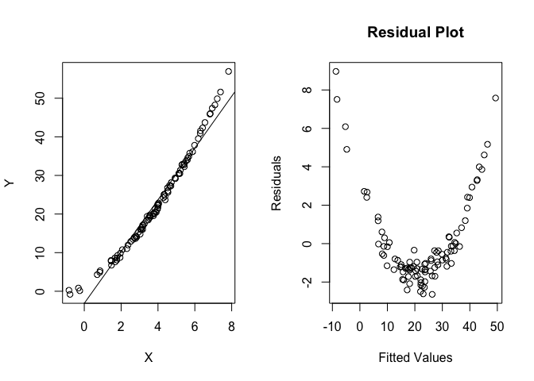<!-- -->

So we can see that when we specify the in correct mean function it is
clearly seen in the residuals. See how we have a trend in the residual
plot. This is what you’ll see when you have a mean function (your model)
defined incorrectly. In the next module we’ll discuss the option of
adding higher order terms to your model to adjust for this problem. For
now the important piece of this is you recognize your problem.

A second problem would be when Non-Constant Variance happens.

``` r
Y2=rep(0,100)
Y3=Y2
for(i in 1:100){
Y2[i]=1000+X[i]+rnorm(1,0,X[i]^2)
Y3[i]=3+X[i]+rnorm(1,0,1/(100*abs(X[i])))
}
M2=lm(Y2~X)
M3=lm(Y3~X)
par(mfrow=c(1,2))
plot(M2$residuals~M2$fitted, xlab="Fitted Values", ylab="Residuals",
main="Residual Plot")
plot(M3$residuals~M3$fitted, xlab="Fitted Values", ylab="Residuals",
main="Residual Plot")
```

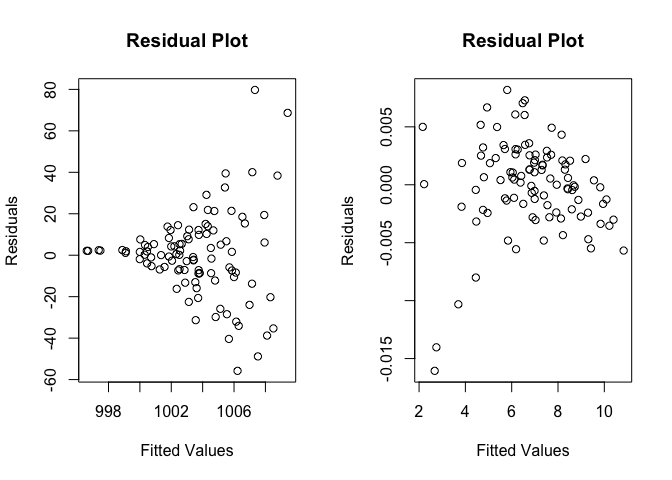<!-- -->

This is referred to as the megaphone type of NCV, it can lean either
way. Another type of NCV that can appear is referred to as a double
outward box, think of this as when these two types of NCV are placed
together forming an oblong shape. The final plot we concern our self
with is when we’ve defined the mean function incorrectly and we have
NCV. Depending on the situation you will be able to see one over the
other.

We can also test to see if we have non-constant variance, which uses the
fact that the expected value of the residuals is zero, which in turn
means that the residuals squared would be the variance. We look at

$$
\epsilon_i^2=\lambda_0+\lambda_1u_i,
$$

Then we can test if $\lambda_1$ is equal to zero using typical
regression methods. The issue here is that we are using regression
models without diagnostics to test to see if we have non-constant
variance. How do we know we can trust this? That is why visually
typically is the safest way to do this.

### Big Mac Example

In a real data example the plots tend to be more difficult to see what
is happening in the problem. Let’s look at the big mac data.

``` r
library(alr4)
attach(BigMac2003)
Mbm=lm(BigMac~log(Bread)+log(Rice))
plot(Mbm$residuals~Mbm$fitted, xlab="Fitted Values", ylab="Residuals",
main="Big Mac Residual Plot")
```

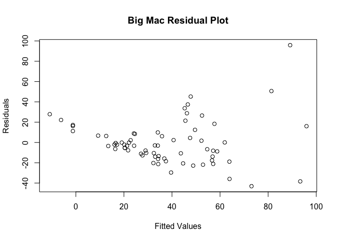<!-- -->

``` r
Mbm%>%ncvTest()
```

    ## Non-constant Variance Score Test 
    ## Variance formula: ~ fitted.values 
    ## Chisquare = 42.2529, Df = 1, p = 8.0201e-11

Let’s look when the appropriate model is used

``` r
library(alr4)
```

    ## Loading required package: car

    ## Loading required package: carData

    ## Loading required package: effects

    ## lattice theme set by effectsTheme()
    ## See ?effectsTheme for details.

``` r
attach(BigMac2003)
Mbm2=lm(log(BigMac)~log(Bread)+log(Rice))
plot(Mbm2$residuals~Mbm2$fitted, xlab="Fitted Values", ylab="Residuals",
main="Big Mac 2 Residual Plot")
```

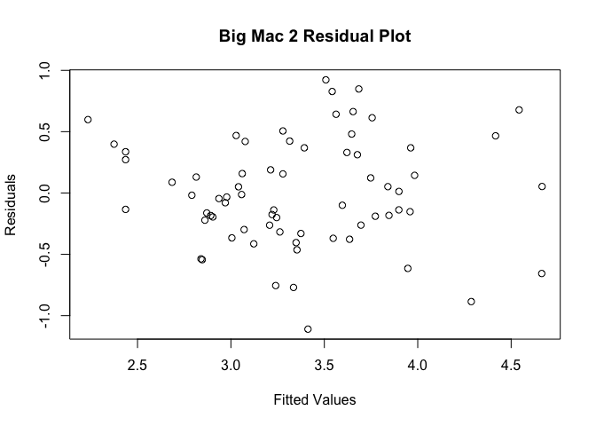<!-- -->

After the log transformations are the linearity and constant variance
assumptions met? Easiest way to check again is

``` r
Mbm2%>%ncvTest()
```

    ## Non-constant Variance Score Test 
    ## Variance formula: ~ fitted.values 
    ## Chisquare = 2.967397, Df = 1, p = 0.084958

The p value seems to indicate that the variance is constant if we test
it at the .05 level. At the .1 level we would say we have non-constant
variance. Again this is why it is so important that you have a great
understanding of the real meaning of p-values.

## Testing for Curvature

In previous discussions of the plot when the model we fit was incorrect,
it is clearly obvious we have a problem with the assumption that
$E(\epsilon \mid U)=0$. The simplest test is to add a the higher order
term (interaction or quadratic terms). The test statistic for the test
is then the test that the higher order terms are zero. This could result
in a t-test for a single coefficient when our linear combination $U$
does not depend on estimated coefficients, so $U \neq \hat{Y}$. If $U$
is based on the estimated coefficients, then we use a $N(0,1)$ Looking
back at our example we have that

``` r
ModCurv=lm(Y~X+I(X^2))
ModCurv%>%summary()
```

    ## 
    ## Call:
    ## lm(formula = Y ~ X + I(X^2))
    ## 
    ## Residuals:
    ##      Min       1Q   Median       3Q      Max 
    ## -1.23721 -0.35252  0.03094  0.32881  1.32114 
    ## 
    ## Coefficients:
    ##             Estimate Std. Error t value Pr(>|t|)    
    ## (Intercept)  1.73978    0.15945   10.91   <2e-16 ***
    ## X            3.09966    0.08451   36.68   <2e-16 ***
    ## I(X^2)       0.49527    0.01099   45.08   <2e-16 ***
    ## ---
    ## Signif. codes:  0 '***' 0.001 '**' 0.01 '*' 0.05 '.' 0.1 ' ' 1
    ## 
    ## Residual standard error: 0.5018 on 97 degrees of freedom
    ## Multiple R-squared:  0.9984, Adjusted R-squared:  0.9984 
    ## F-statistic: 3.091e+04 on 2 and 97 DF,  p-value: < 2.2e-16

``` r
plot(ModCurv$residuals~ModCurv$fitted,
xlab="Residuals", ylab="Fitted")
```

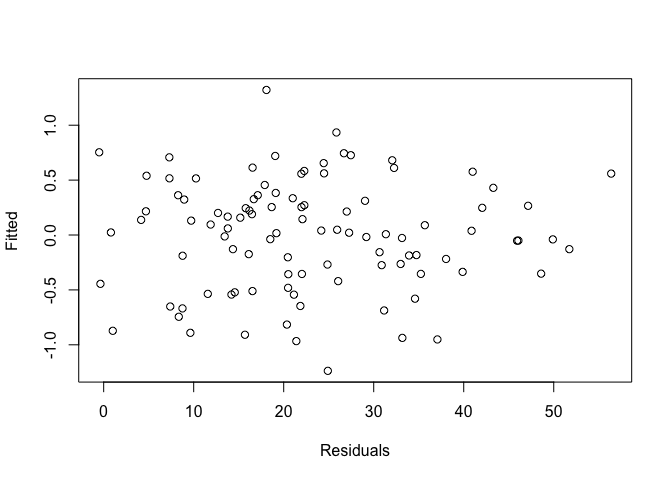<!-- -->

So we see adding the term fixes the residuals, but the most important
thing is we have a p-value to confirm the assumption of
$E(\epsilon \mid U)=0$ is broken. If we want to check to see if there is
overall curvature we would fit $Y\sim \hat{Y}+\hat{Y}^2$ and compare it
to a $N(0,1)$ it is known as the Tukey test for nonadditivity. To do
this in R we use the car package in R

``` r
library(car)
Mod1%>%residualPlots()
```

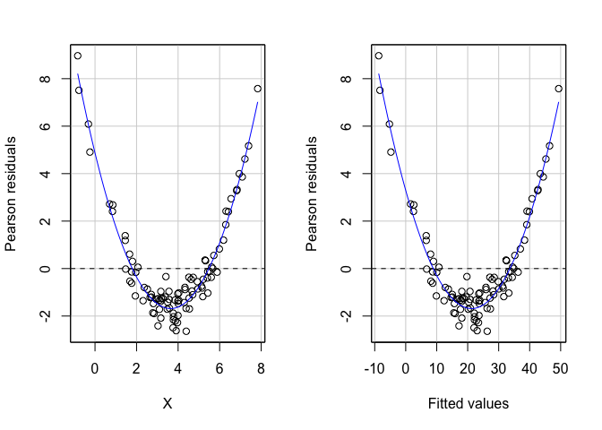<!-- -->

    ##            Test stat Pr(>|Test stat|)    
    ## X             45.081        < 2.2e-16 ***
    ## Tukey test    45.081        < 2.2e-16 ***
    ## ---
    ## Signif. codes:  0 '***' 0.001 '**' 0.01 '*' 0.05 '.' 0.1 ' ' 1

We will discuss this more in detail later in this course.

## Fixing Non Constant Variance

### Weighted Least Squares (WLS)

Up to this point every model we have discussed in some way shape or form
makes the assumption that $$
E(Y\mid X)=X\beta\\
Var(Y \mid X=x_i)=\Var(\epsilon_i)=\sigma^2
$$

That is great but let’s take a moment and think about problems where
this wouldn’t exist. Let’s say we’re observing the height of children
based on age. We know younger children may not vary highly in height
while adults may. Think about what the difference of 1 to 3 inches means
at age 5 and age 16. So there is no possibility the variance is
constant. In business you can think of this as revenue/fees based on the
time customer has spent with a bank. \$3 over a single year is more
impactful than \$3 over 20 years.

Below we want to look at the wblake data at the relationship between the
scale radius and age of the fish. Look at the wblake help file for full
details on the data.

``` r
library(alr4)
plot(wblake$Scale~wblake$Age, main="Increasing Variance",xlab="Age",ylab="Length of Scale")
```

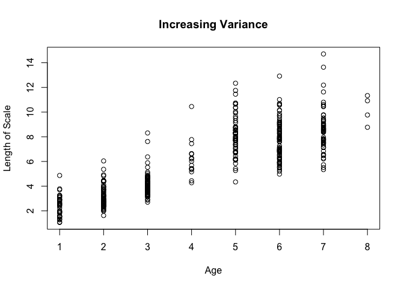<!-- -->

Notice how the the variance increases as the age increases we can again
think of this as the age of a product or portfolio and the response is
the return. We know our methods are in trouble when this happens, so the
question becomes what do we do?

In situations where the constant variance assumption is wrong, we can
use a more general setting. Now assume $$
Var(\epsilon_i)=\frac{\sigma^2}{w_i}.
$$

Where $w_i$ is a KNOWN positive number for each observation,
$i=1,\ldots,n$. Notice this is just a constant variance assumption when
$w_i=1$ for each observation. To implement this assumption into a linear
regression framework we need to define $W$ to be an $n \times n$
diagonal matrix where $w_i$ is the $i$th diagonal element. Incorporating
this into a RSS framework we have that $$
RSS(\beta)=(Y-X\beta)^TW(Y-X\beta),
$$ where we use the assumptions are $$
E(Y\mid X)=X\beta\\
Var(\epsilon)=\sigma^2W^{-1},
$$

This comes from the theoretical assumption
$Y\mid X=x_i \sim N(x_i^T\beta, \frac{\sigma^2}{w_i} )$. In terms of a
sum we can also write $$
RSS(\beta)=\sum_{i=1}^n w_i(y_i-x_i^T\beta)^2
$$

The estimator produced from the WLS RSS, is $$
\hat{\beta}_{WLS}=(X^TWX^T)^{-1}X^TWY.
$$

In the application of this methodology the weights are predefined. For
instance look at the fish data we referred to above. How would we define
the weights. The idea is that we need the variance to resemble $$
Var(\epsilon_i)=\frac{\sigma^2}{w_i}=\sigma^2_{Age}.
$$

Where $\sigma^2_{Age}$ is the variance at each of the observed ages. So
we need to solve the equation $$
\frac{\sigma^2}{w_i}=\sigma^2_{Age}
$$

So it seems since $\sigma^2$ is the same for all values of Age, we can
arbitrarily set it. It is easier to just assume this is 1 in any case.
It is arbitrary so this makes life easier. Setting $\sigma^2=1$ and then
solving for $w_i$ we get $$
w_i=\frac{1}{\sigma^2_{Age}}
$$

This means we just need to calculated the within age variance to have
the weights. Notice this means when we are doing prediction the only
points that are valid for prediction are where we have weights. This is
something we need to keep in mind, to do any type of modeling with
weights we have to be able to define the weights.

The question is how do we fit this in R? It simple all we have to do is
define our vector of weights.

This depends on what age we are so what we do is

``` r
attach(wblake)
Var=tapply(Scale,Age,var)
Wts=rep(0,length(Scale))
for(i in 1:length(Age)){
    Wts[i]=1/Var[Age[i]]    
}

Mod=lm(Scale~Age,weight=Wts)
Mod%>%summary()
```

    ## 
    ## Call:
    ## lm(formula = Scale ~ Age, weights = Wts)
    ## 
    ## Weighted Residuals:
    ##     Min      1Q  Median      3Q     Max 
    ## -2.1142 -0.7241 -0.1357  0.6930  4.6436 
    ## 
    ## Coefficients:
    ##             Estimate Std. Error t value Pr(>|t|)    
    ## (Intercept)  0.89227    0.11608   7.687 1.01e-13 ***
    ## Age          1.16038    0.03209  36.160  < 2e-16 ***
    ## ---
    ## Signif. codes:  0 '***' 0.001 '**' 0.01 '*' 0.05 '.' 0.1 ' ' 1
    ## 
    ## Residual standard error: 1.085 on 437 degrees of freedom
    ## Multiple R-squared:  0.7495, Adjusted R-squared:  0.7489 
    ## F-statistic:  1308 on 1 and 437 DF,  p-value: < 2.2e-16

``` r
summary(lm(Scale~Age))
```

    ## 
    ## Call:
    ## lm(formula = Scale ~ Age)
    ## 
    ## Residuals:
    ##     Min      1Q  Median      3Q     Max 
    ## -3.7186 -0.8980 -0.2533  0.7177  5.6458 
    ## 
    ## Coefficients:
    ##             Estimate Std. Error t value Pr(>|t|)    
    ## (Intercept)  1.05645    0.16009   6.599  1.2e-10 ***
    ## Age          1.14391    0.03443  33.221  < 2e-16 ***
    ## ---
    ## Signif. codes:  0 '***' 0.001 '**' 0.01 '*' 0.05 '.' 0.1 ' ' 1
    ## 
    ## Residual standard error: 1.434 on 437 degrees of freedom
    ## Multiple R-squared:  0.7163, Adjusted R-squared:  0.7157 
    ## F-statistic:  1104 on 1 and 437 DF,  p-value: < 2.2e-16

Looking at the comparison we see that the fit changes. We also have that
$$
Var(\hat{\beta}_{WLS})=\sigma^2(X^TWX)^{-1}
$$

``` r
plot(wblake$Scale~wblake$Age, main="Increasing Variance",xlab="Age",ylab="Length of Scale")
Mod%>%abline()
abline(lm(Scale~Age))
```

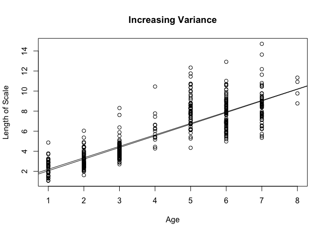<!-- -->

So we can see the two different fits. The idea we want to focus on
predicting where we have smaller variance of the errors, or in most
cases the distribution of $(Y \mid X)$. One way to check our model is to
check to see if $\hat{\sigma^2}$ is essentially 1. If not it means we
may have a lack of fit.

### Strongx Example

The physics data represents a process from physics, this is the example
of a bad help file in R. It will suffice for what we need though, $X$
represents the inverse of total energy, $Y$ represents a scattering
cross section, and then an estimate of the standard deviation, $SD$. We
have a model that is the following

``` r
library(alr4)
data(physics)
plot(y~x,physics,type="b")
m2<-lm(y~x,physics,weights=1/SD^2)
m1<-lm(y~x+I(x^2),physics,weights=1/SD^2)
lines(physics$x,m1$fitted,col=2,lty=2)
m2%>%abline(col=3,lty=3)
m3<-lm(y~x+I(x^2),physics)
lines(physics$x,m3$fitted,col=4,lty=4)
legend("topleft",lty=c(2,3,4),col=c(2,3,4), legend=c("Quadratic WLS", "Linear WLS","Quadratic OLS" ))
```

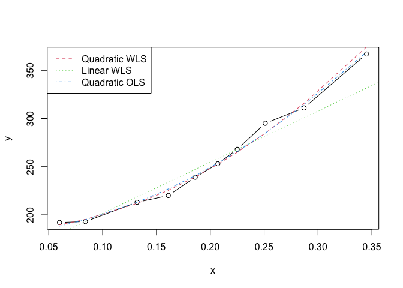<!-- -->

Comparing the fit of the models we see that the quadratic WLS model
seems to fit better in area with lower standard deviations which makes
sense to us.

``` r
m1%>%summary()
```

    ## 
    ## Call:
    ## lm(formula = y ~ x + I(x^2), data = physics, weights = 1/SD^2)
    ## 
    ## Weighted Residuals:
    ##      Min       1Q   Median       3Q      Max 
    ## -0.89928 -0.43508  0.01374  0.37999  1.14238 
    ## 
    ## Coefficients:
    ##              Estimate Std. Error t value Pr(>|t|)    
    ## (Intercept)  183.8305     6.4591  28.461  1.7e-08 ***
    ## x              0.9709    85.3688   0.011 0.991243    
    ## I(x^2)      1597.5047   250.5869   6.375 0.000376 ***
    ## ---
    ## Signif. codes:  0 '***' 0.001 '**' 0.01 '*' 0.05 '.' 0.1 ' ' 1
    ## 
    ## Residual standard error: 0.6788 on 7 degrees of freedom
    ## Multiple R-squared:  0.9911, Adjusted R-squared:  0.9886 
    ## F-statistic: 391.4 on 2 and 7 DF,  p-value: 6.554e-08

``` r
m2%>%summary()
```

    ## 
    ## Call:
    ## lm(formula = y ~ x, data = physics, weights = 1/SD^2)
    ## 
    ## Weighted Residuals:
    ##     Min      1Q  Median      3Q     Max 
    ## -2.3230 -0.8842  0.0000  1.3900  2.3353 
    ## 
    ## Coefficients:
    ##             Estimate Std. Error t value Pr(>|t|)    
    ## (Intercept)  148.473      8.079   18.38 7.91e-08 ***
    ## x            530.835     47.550   11.16 3.71e-06 ***
    ## ---
    ## Signif. codes:  0 '***' 0.001 '**' 0.01 '*' 0.05 '.' 0.1 ' ' 1
    ## 
    ## Residual standard error: 1.657 on 8 degrees of freedom
    ## Multiple R-squared:  0.9397, Adjusted R-squared:  0.9321 
    ## F-statistic: 124.6 on 1 and 8 DF,  p-value: 3.71e-06

A general setting where WLS is useful when we have repeated measures
when our predictor. That means that we have more than one observation
for EVERY value of $X$. We can also use summary statistics of these
repeated measures such as means. For instance Say we have millions of
observations, but they only exist at a finite amount of $x$’s. For
example let’s say 5 values of $x$. Typically in regression we are only
interested in the mean functions of the data, so what is typically done
is to save summary statistics of the data. For instance for every $X=j$,
that is every for every unique value of $X$ we need
$(X_j,\bar{Y}_j,n_j,\Var(Y_j)$. This is also reducing us from $n$
observations to $G=5$ observations Then what we have to do is realize
the variance of the response is the mean, that means assuming constant
variance what we have is $$
Var(\bar{Y}\mid X=x_j)=\frac{\sigma^2}{n_j}
$$

In this case it means that the weight is just the sample size at $x_j$.
This is a common practice, we can also adjust it so the variance depends
on more than just the sample size, we can easily see how that will work.
This is a powerful setting, for instance we want to assume $$
\Var(\bar{Y}\mid X=x_j)=\frac{\sigma^2_j}{n_j}=\frac{\sigma^2}{w_j}.
$$

So in this case $w_j=\frac{n_j}{\sigma^2_j}$ and $\sigma^2=1$.

We could also have the case when the we can have multiple responses for
the same observation. Think about the rate my professor case let
$y_{ij}$ represent the $i$th students rating of the $j$th professor.
Given the students have given ratings for an instructor being easy,
$x_{1ij}$ and $x_{2ij}$ is the $i$th students interest in the subject
that professor $j$ teaches. The idea is that $\bar{y}_j$ is the average
overall rating for professor $j$. We use $$
y_{ij}=\beta_0+\beta_1x_{1ij}+\beta_2x_{2ij}+\epsilon_ij
$$ Then we have that $$
\bar{y}_j=\frac{1}{n_j}\sum_{i=1}^{n_j}(\beta_0+\beta_1x_{1ij}+\beta_2x_{2ij}+\epsilon_{ij})\\
=\beta_0+\beta_1\bar{x}_{1j}+\beta_2\bar{x}_{2j}+\bar{\epsilon}_j
$$ Where $n_j$ is the number of students who gave ratings for professor
$j$.

So we know the variance $\Var(\bar{\epsilon}_j)=\frac{\sigma^2}{n_j}$

### WLS as a function of $X$

There is another case where WLS is useful. That is when we have a
strictly continuous variable $X$, no repeated measures. That means there
is no great way to to define the variance at any given point but we do
observed an overall trend. Look at the following plot.

``` r
cars%>%plot(main="Stopping Distance of Cars")
```

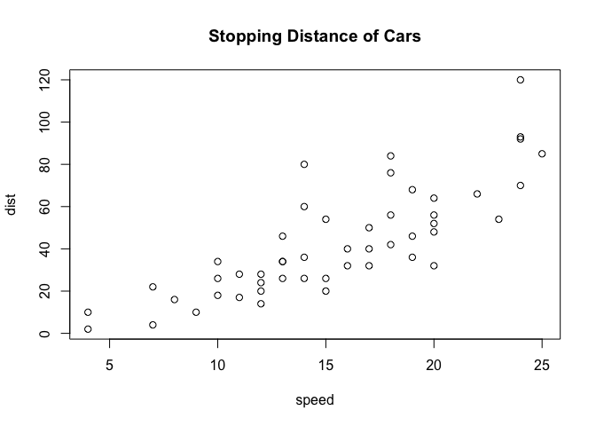<!-- -->

This data has to do with the speed of cars and stopping distance. We can
see the larger the distance the further the stopping distance but we can
also see an increasing variance in the distance needed to stop as age
increases. We need a way to model this because there is no way to define
the variance for each point, since we only have a single observation. We
need a way to utilize the information of non-constant variance. To do
this define $g(x)$ to be a positive function for all possible $x$. We
can think of this as $\mid x\mid$ or $x^2$, even $exp(\mid x\mid)$. So
we define our model as $$
E(Y\mid X)=X\beta\\
Var(\epsilon_i)=\sigma^2g(x_i)
$$

The thing is we must be able to define $g(x)$. This is the hard part we
need to be able to decide the kernel of the function, meaning is it
linear, quadratic, exponential. There have been tests developed for
dealing with this problem which we will discuss as we move throughout
the problem.

Let’s look at three cases of mean weights for the car data using linear
regression.

``` r
cars%>%plot(main="Stopping Distance")
Mc1=lm(dist~speed,cars,weights=1/abs(speed))
Mc2=lm(dist~speed,cars,weights=1/speed^2)
Mc3=lm(dist~speed,cars,weights=exp(speed))
abline(Mc1)
abline(Mc2,col=2,lty=2)
abline(Mc3,col=3,lty=3)
legend("topleft", lty=c(1,2,3),col=c(1,2,3),legend=c("Absolute Values", "Quadratic","Exponential"))
```

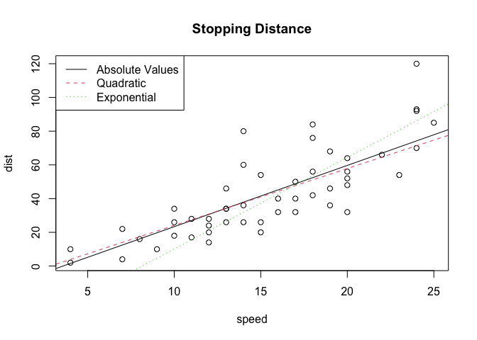<!-- -->

### What Happens When We Define The Weights Wrong?

We can easily define the wrong variance weights the question is it wrong
when we do. Define the true model to be

The model we define is This could be as easy as saying $W_0=I$ which
would lead to fitting OLS instead of the proper WLS. The estimator
$\hat{\beta}_0$ be the WLS estimator based on $W_0$. We still have that
$\hat{\beta}_0$ is unbiased, see your text for that proof. The resulting
variance will be incorrect. The resulting variance is

So we can see it’s not as simple as it should be and to formally define
this we need to know the true variance, and then the incorrect variance,
which in practice is impossible. If we knew both why would we use the
incorrect one.

### NCV Example

So this seems complicated and it is easily programmed in R, the question
becomes what do we do in fitting a model. Let’s define a model where we
have non-constant variance.

``` r
set.seed(530)
X=rnorm(100,3,2)
Errors=rep(0,100)
for(i in 1:100){
Errors[i]=rnorm(1,0,(X[i])^2)
}
Y=30+20*X+Errors
Mncv=lm(Y~X)
plot(Y~X, main="Simulated Data")
```

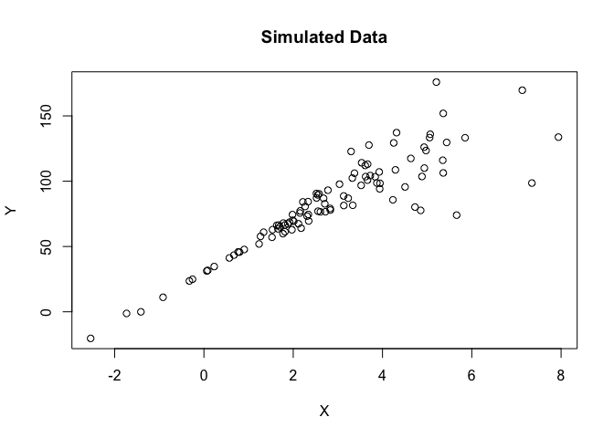<!-- -->

``` r
plot(Mncv$residuals~Mncv$fitted, xlab="Fitted Values", ylab="Residuals",main="Residual Plot")
```

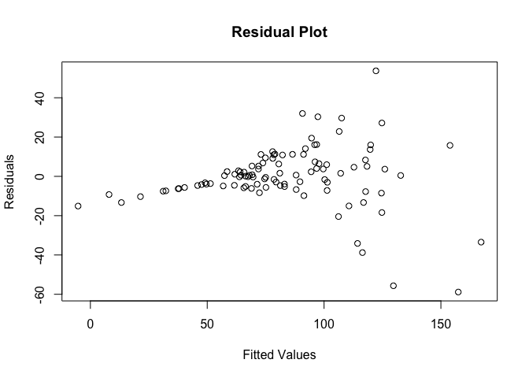<!-- -->

``` r
plot(Mncv$residuals~X,ylab="Residuals",main="Residual vs X")
```

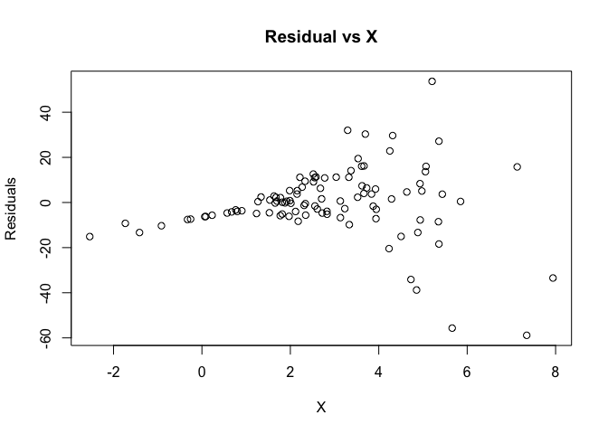<!-- -->

The question becomes we can see that ncv is present how do we obtain a
p-value for the NCV test.

``` r
Mncv%>%ncvTest()
```

    ## Non-constant Variance Score Test 
    ## Variance formula: ~ fitted.values 
    ## Chisquare = 62.44688, Df = 1, p = 2.7373e-15

In this test we look at the residuals against, $\hat{Y}$, so we confirm
that the test is a function of the fitted values. What if we want to
test that the NCV is a function of $X$ we do

``` r
Mncv%>%ncvTest(~X)
```

    ## Non-constant Variance Score Test 
    ## Variance formula: ~ X 
    ## Chisquare = 62.44688, Df = 1, p = 2.7373e-15

In this case we are looking for ncv of the residuals against $X$ which
makes sense by the set up of the data set. Let’s say we get lucky and
can define the weights correctly so fit the ols to be

``` r
WLSM=lm(Y~X,weights=1/X^2)
WLSM%>%summary()
```

    ## 
    ## Call:
    ## lm(formula = Y ~ X, weights = 1/X^2)
    ## 
    ## Weighted Residuals:
    ##      Min       1Q   Median       3Q      Max 
    ## -11.6366  -1.7861   0.0754   2.2857   8.7238 
    ## 
    ## Coefficients:
    ##             Estimate Std. Error t value Pr(>|t|)    
    ## (Intercept)  30.0660     0.1738  173.04   <2e-16 ***
    ## X            19.4004     0.3676   52.78   <2e-16 ***
    ## ---
    ## Signif. codes:  0 '***' 0.001 '**' 0.01 '*' 0.05 '.' 0.1 ' ' 1
    ## 
    ## Residual standard error: 3.526 on 98 degrees of freedom
    ## Multiple R-squared:  0.966,  Adjusted R-squared:  0.9657 
    ## F-statistic:  2785 on 1 and 98 DF,  p-value: < 2.2e-16

### Intervals

The variance for prediction intervals changes in these cases we know
weights we define $$
sepred(\tilde{y}_*\mid x)=\sqrt{\hat{\sigma}^2/w_*+sefit(\hat{y}_*\mid x)^2}.
$$ We define $w_*$ based on the weights for $x$. Let’s look at the
difference between the two models for the simulated data above using a
WLS model that we have previously defined.

``` r
CIS=predict(WLSM,weights=1/exp(X),interval="confidence")
plot(Y~X)
WLSM%>%abline()
points(X,CIS[,2],col=3)
points(X,CIS[,3],col=4)
PIS=WLSM%>%predict(weights=1/exp(X), interval="prediction")
```

    ## Warning in predict.lm(., weights = 1/exp(X), interval = "prediction"): predictions on current data refer to _future_ responses

``` r
points(X,PIS[,2],col=5)
points(X,PIS[,3],col=6)
```

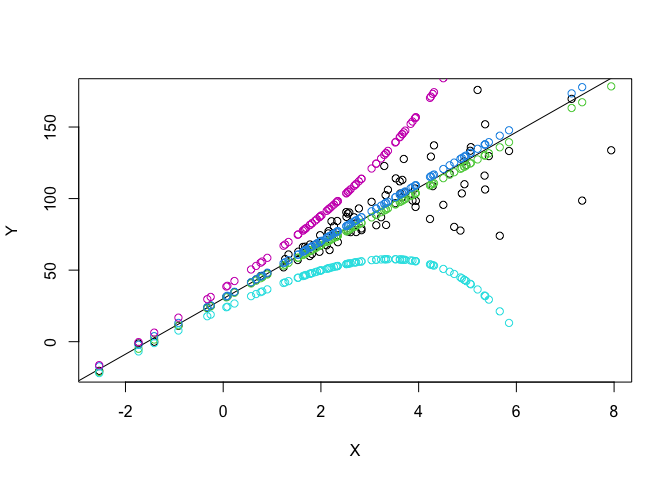<!-- -->

``` r
CIS=Mncv%>%predict(interval="confidence")
plot(Y~X)
abline(Mncv)
points(X,CIS[,2],col=3)
points(X,CIS[,3],col=4)
PIS=Mncv%>%predict(interval="prediction")
```

    ## Warning in predict.lm(., interval = "prediction"): predictions on current data refer to _future_ responses

``` r
points(X,PIS[,2],col=5)
points(X,PIS[,3],col=6)
```

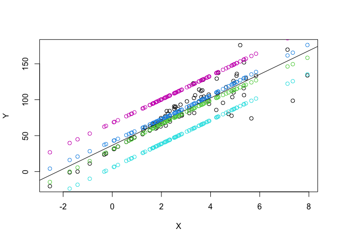<!-- -->

We can see there isn’t much difference in the mean functions, the major
difference happens when we try to do prediction and CI’s. The WLS plays
a big role in this.

### Choosing Weights

This section is somewhat important for how you choose the weights in
your model, the theoretical distribution piece isn’t the most important
part but understanding how to tell if two different sets of weights

To use WLS it makes no sense to view the fitted value as possible
weights. What we can do is use the idea that let $S_1$ follow a
chi-square distribution with $m$ degrees of freedom and $S_2$ be a chi
square distribution with $k$ degrees of freedom, $k<m$. Then $$
S_1-S_2 \sim \chi^2(m-k).
$$ This tests look to see if the more complex weighting is better than
the less complex weighting.

For instance lets say we have 2 possible weights $\mid X \mid$ and
$\mid X\mid + X^2$ using our simulated example. We would do the
following

``` r
(S2=ncvTest(Mncv, ~abs(X)))
```

    ## Non-constant Variance Score Test 
    ## Variance formula: ~ abs(X) 
    ## Chisquare = 78.31433, Df = 1, p = < 2.22e-16

``` r
(S1=ncvTest(Mncv,~abs(X)+I(X^2)))
```

    ## Non-constant Variance Score Test 
    ## Variance formula: ~ abs(X) + I(X^2) 
    ## Chisquare = 100.9034, Df = 2, p = < 2.22e-16

``` r
names(S2)
```

    ## [1] "formula"      "formula.name" "ChiSquare"    "Df"           "p"           
    ## [6] "test"

``` r
pchisq(S1$ChiSquare-S2$ChiSquare, 1,lower.tail=FALSE)
```

    ## [1] 2.006258e-06

So in this case we would use the quadratic form.

Let’s say we want to see if we need an exponential of $X$ instead. We
could do

``` r
(S2=ncvTest(Mncv, ~exp(X)))
```

    ## Non-constant Variance Score Test 
    ## Variance formula: ~ exp(X) 
    ## Chisquare = 62.52503, Df = 1, p = 2.6308e-15

``` r
(S1=ncvTest(Mncv,~exp(X)+I(X^2)))
```

    ## Non-constant Variance Score Test 
    ## Variance formula: ~ exp(X) + I(X^2) 
    ## Chisquare = 97.78366, Df = 2, p = < 2.22e-16

``` r
names(S2)
```

    ## [1] "formula"      "formula.name" "ChiSquare"    "Df"           "p"           
    ## [6] "test"

``` r
pchisq(S1$ChiSquare-S2$ChiSquare, 1,lower.tail=FALSE)
```

    ## [1] 2.887008e-09

Again we see that we should use the more complex form. Note we have to
use submodels for this test which we will discuss more in the next
section.

### Variance Stabilizing Transformations

To me this is one of the most important sections in the course, and
maybe in statistical modeling. It’s really about how do we get a hold of
variance to understand what is going on. From a practical standpoint
this is my go to in modeling. Weighted least squares is a great tool,
but practicality is limiting, you need to know it’s in the tool set, but
transformations are broadly applicable.

In this section we have seen a NCV test, but the question is how do we
fix non-constant variance. We know that if we can define the the
function of the variance as $Var(\epsilon)=\sigma^2g(x)$, where $g(x)>0$
for all values of $x$ and is a simple function (not to complex and we
can write it down). Then we can just use WLS. WLS is a great thing when
we can use it because we can define a variance function and don’t have
to change anything in the residuals. When this doesn’t work we use what
is referred to as the variance stabilizing transformations, specifically
in the case where we can write $$
Var(Y \mid X=x)-\sigma^2g(E(Y\mid X))
$$

The idea is to find a transformed $Y$, $Y_T$, such that
$Var(Y_T \mid X)\approx \sigma^2_T$. Notice we are saying $\approx$ in
this case not exact. There are certain cases where we know the
appropriate transformation based on $g(E(Y\mid X))$.

- $Y_T=\sqrt{Y}$

Used when $Var(Y\mid X) \propto E(Y \mid X)$. Think of this as a Poison
distribution where the mean is equal to the variance. The sign $\propto$
means equal up to a constant. If counts are small we can use the
transformation $Y_T=\sqrt{Y}+\sqrt{Y+1}$

- $Y_T=\log(Y)$

Used when $Var(Y\mid X) \propto (E(Y \mid X))^2$. In this case the
errors behave like a precentage of the response. This is what we’ve
discussed previously when talking about log transformations. Probably
the most commonly used variance stabilizing transformation.

- $Y_T=\frac{1}{Y}$

Used when $Var(Y\mid X) \propto (E(Y \mid X))^4$. This case can occur
when values of $Y$ are close to zero but large numbers can occur
occasionally. Typically preformed when the response is time till an
event.

\*$Y_T=\sin^{-1}(\sqrt{Y})$

The arcsine square rot-transformation is used if $Y$ is a proportion, or
$Y$ has a range that can be transformed to (0,1).

There are other options we can use for fixing NCV, such as using models
that allow that account for non-constant variance, genearlized linear
models which we will discuss in depth in BUDA 530. Another thing we can
do is just leave the model alone, and estimate parameters using
bootstrap.

### Fuel Data Example

To get an idea of the possible transformations we can use, let’s look at
the fuel data using

``` r
data(fuel2001)
FuelMod=lm(FuelC~Tax+log(Drivers)+log(Miles)+Income,data=fuel2001)
FuelMod%>%residualPlot()
```

<!-- --> Let’s look
at both the square root and $\log$ transformations.

``` r
par(mfrow=c(2,2))
FuelL=lm(log(FuelC)~Tax+log(Drivers)+log(Miles)+Income, data=fuel2001)
FuelL%>%residualPlot()
FuelS=lm(sqrt(FuelC)~Tax+log(Drivers)+log(Miles)+Income,data=fuel2001)
FuelS%>%residualPlot()
FuelL%>%ncvTest()
```

    ## Non-constant Variance Score Test 
    ## Variance formula: ~ fitted.values 
    ## Chisquare = 1.472876, Df = 1, p = 0.22489

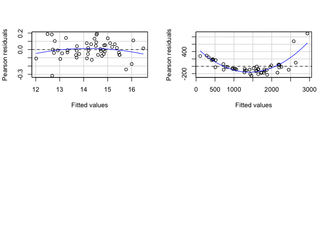<!-- -->

The left panel is the result of the log transformation while the right
plot is the square root transform. We can see the $\log$ transform seems
to do the job. Checking the tukey non additivity test we get

``` r
residualPlots(FuelL)
```

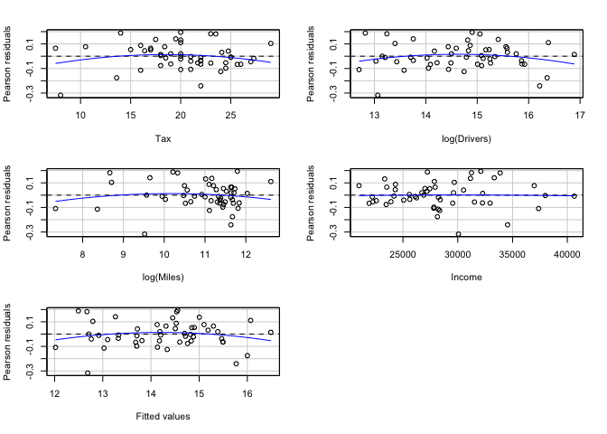<!-- -->

    ##              Test stat Pr(>|Test stat|)
    ## Tax            -1.1896           0.2405
    ## log(Drivers)   -1.2331           0.2240
    ## log(Miles)     -0.7795           0.4398
    ## Income         -0.0958           0.9241
    ## Tukey test     -1.1059           0.2687

So we can see we got rid of all of the issues we saw previously by
transforming out the issues we have seen.

### Marginal Model Plots

Our discussion to this point has been to see how well the model matches
the assumptions we have made on the data. We can augment the model to
meet this criterion. A second and just as important question is how well
the model matches the data graphically. In the SLR setting we can fit a
smoother to our model, and see if the two models agree to a certain
extent. Again using the data from the cedar trees we have the regression
of $Height~Dbh$

``` r
c1 <- lm(Height ~ Dbh, ufcwc)
   c1%>%mmp(ufcwc$Dbh, label="Diameter, Dbh", col.line=c("blue", "red"))
```

    ## Warning in plot.window(...): "label" is not a graphical parameter

    ## Warning in plot.xy(xy, type, ...): "label" is not a graphical parameter

    ## Warning in axis(side = side, at = at, labels = labels, ...): "label" is not a
    ## graphical parameter
    ## Warning in axis(side = side, at = at, labels = labels, ...): "label" is not a
    ## graphical parameter

    ## Warning in box(...): "label" is not a graphical parameter

    ## Warning in title(...): "label" is not a graphical parameter

    ## Warning in plot.xy(xy.coords(x, y), type = type, ...): "label" is not a
    ## graphical parameter

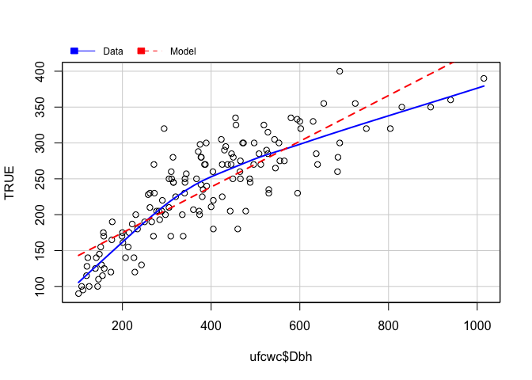<!-- -->

So using this type of model we can visually discuss the fit or lack
there of in the model. Another way to do this, and in essence is the
same thing is to use marginal model plots. Marginal model plots where we
plot $Y$ on the vertical axsis, and some $U$ could be $X$, $\hat{Y}$, or
any relevant transformation or combination of $X$ we think is
interesting. Fitting a smoother to this plot produces an estimate of
$E(Y \mid U)$ without making any modeling assumptions. We then compare
this smooth to $\E(\hat{Y} \mid U)$.

To do this we create a smoother of $Y~U$ and then compare it to a
smoother of $\hat{Y}~U$. Using the UN data from previous sections we
will show an example of how to do this in R.

``` r
m1 <- lm(log(fertility) ~ log(ppgdp) + pctUrban, UN11)
m1%>%mmps()
```

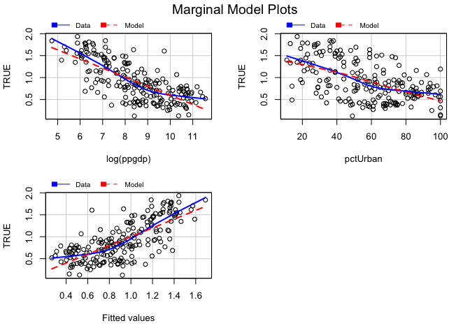<!-- -->

We can check the variance function as well, all we need to do is add the
sd=TRUE statement to the code for the marginal model plot.

``` r
m1%>%mmps(sd=TRUE)
```

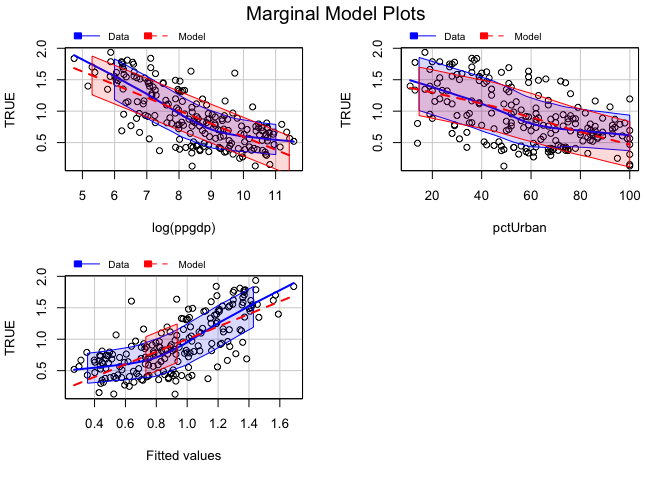<!-- -->

And for the marginal model plot for the cedar tree data we have that

``` r
c1%>%mmp(ufcwc$Dbh ,sd=TRUE)
```

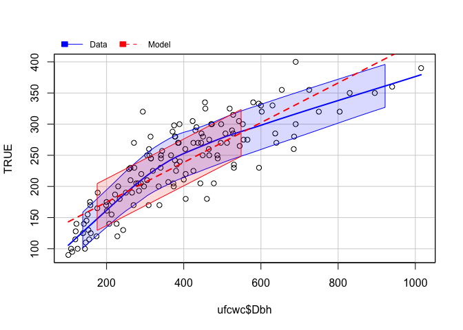<!-- -->

This is an easy way to communicate how well your model fits based on
what you are seeing, and how to adjust when variances are wrong.
Typically transformations are your best bet, unless you know exactly
where your NCV is.

### Summary

Overall this section is one of the more useful in the field I think. To
do any kind of inference in regression we need to check the assumptions
of $E(\epsilon \mid U)=0$ and $Var(\epsilon)=\sigma^2$. If these
assumptions are not met we have many different options at our disposal.
In the case of non constant variance we have things to try

- Weight/Generalized Least Squares (requires weights to be defined)
- Generalized Linear Model (Ch 13 focuses on logistic and Poisson)
- Variance Stabilizing Transformations
- Do nothing (Correct for wrong variances)

In the case where the mean function is defined incorrectly we again have
a few options. The first is do add complex terms, interactions, or
quadratic terms which we discuss in the next module. Or we could preform
a transformation technique from which we will discuss next, that will
give us normality. Power Transformation, or in general box-cox, will do
the trick. Note this is one of the few times bootstrap will not help due
to the fact the mean function will be improperly defined.

## General Transformations

Throughout the course we have seen problems where the variables have
been transformed previously or we have done it to make the problem
simpler. We know need to discuss how/when we know that a transformation
is needed. To simply state it transformations are there to make the
linear assumption fit the data. In a two variable problem we are seeking
some transformed variable $Y$ and some transformed varaible $X$ such
that $$
E(Y \mid X) \approx \beta_0+\beta_1X
$$

Notice we are not saying $=$ we are saying $\approx$, that means the
exact linearity isn’t a requirement. In a two variable problem this is
not extremely difficult, but in a multiple variable problem this can be
difficult. We are going to start with an SLR problem based on the
comparison of body and brain weight of mammals.

``` r
library(alr4)
library(MASS)
data(brains)
plot(brains)
```

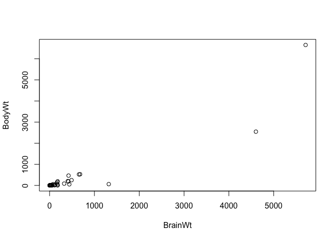<!-- -->

The question now becomes what do we do. We know the linear regression of
BrainWt and BodyWt won’t work, so what transformation is appropriate?

### Power Transformations

We define a transformation family as a collection of transformations
that can be indexed by one or a few parameters. The most commonly used
is referred to as the power family, which is defined for some strictly
POSITIVE variable $U$ $$
\psi(U,\lambda)=U^\lambda.
$$

We can vary $\lambda$ from negative infinity to positive infinity, but
normally we put $\lambda$ in the range \[-1,1\] or \[-2,2\]. We need to
develop a special case for when $\lambda=0$, if we followed the
transformation all elements would be 1. This isn’t beneficial to any one
so we define $$
\psi(U,0)=\log(U).
$$ Also notice that $\psi(U,1)=U$ which means no transformation.

Some statistical packages allow for us to plot data and use slidebars to
pick the perfect transformation. This isn’t always the case, as we’ve
found in R. Some times in a two variable problem the guess and test
method works. The plots below are a transformations of both variables at
$\lambda=\{-1,0,1/2,2\}$.

``` r
attach(brains)
par(mfrow=c(2,2))
plot(1/BrainWt~1/BodyWt)
plot(log(BrainWt)~log(BodyWt))
plot(sqrt(BrainWt)~sqrt(BodyWt))
plot(BrainWt^2~BodyWt^2)
```

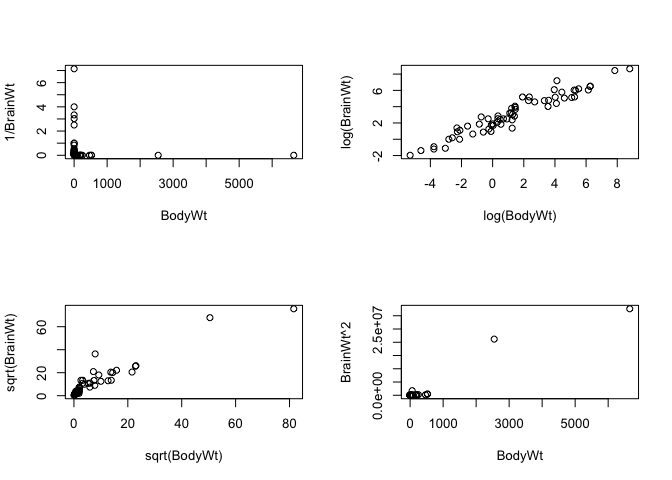<!-- -->

We can see that the case where log transformation gives a linear mean
function. This is a double edged sword, we gain linearity, a nice mean
function. We lose interpret-ability by taking the log transformation
(sort of).

As for when to use log transformations we have two rules of thumb

- **The Log Rule** If the values of a variable range over more than one
  order of mgnitude and the variable is strictly positive, then using a
  log transformation will likely help.

- **The Range Rule** If the range of a variable is considerably less
  than one order of magnitude than any transformation is likely to not
  help at all

The idea of order of magnitude means the ratio of the max to min. Notice
all these rules only apply for strictly positive variables. In this case
we see that

``` r
summary(brains)
```

    ##     BrainWt            BodyWt        
    ##  Min.   :   0.14   Min.   :   0.005  
    ##  1st Qu.:   4.25   1st Qu.:   0.600  
    ##  Median :  17.25   Median :   3.342  
    ##  Mean   : 283.14   Mean   : 198.794  
    ##  3rd Qu.: 166.00   3rd Qu.:  48.201  
    ##  Max.   :5711.86   Max.   :6654.180

### Transforming only the Predictor

Sometimes it makes sense to transform both the predictor and the
response, but in other times, we want to leave one or the other alone.
This can be the fact that we do not believe we can interpret a
transformation. For now let’s direct our attention to the SLR problem
and focus on transformations of the predictors. To do this we will use
what is known as a scaled power transform family that is a family where
$$
\psi_S(X,\lambda)=\frac{X^\lambda-1}{\lambda}\,\,\,\,\, \lambda \neq 0\\
= log(X) \,\,\,\, \lambda=0
$$

So what makes this different from power transformation? The first thing
is it is scaled power transform preserve the direction of association.
In basic power transformations if $\lambda$ changes sign the direction
of the relationship changes. Another nice thing, that we never use is
that is continuous with respect to $\lambda$. That means as $\lambda$
approaches to $\infty$ $\psi_S(X,\lambda)=log(X)$.

The main idea for transforming the predictor is given we have the mean
function $$
E(Y \mid X)=\beta_0+\beta_1\psi_S(X,\lambda).
$$

We know we can fit this model from OLS, all we do is minimize the RSS
with respect to $\lambda$. That is find the $\hat\lambda$ that minimize
$RSS(\lambda)$. Since we already know $X$ and $Y$ that isn’t to hard.
The really nice thing is we only want to use $\lambda$ that make sense
to use. So in most cases we use a grid that looks like $$
\lambda \in \{-1, -1/2, 0, 1/3, 1/2, 1\}
$$

Normally getting more specific than this is pointless because what does
$X^{.345761}$ actually mean? The choices of $\lambda$ above have at
least some nice explanation. The graphical way to do this in R is by
calling a function called invTranPlot. Below is an example from the
ufcwc data in R.

``` r
attach(ufcwc)
invTranPlot(Dbh, Height )
```

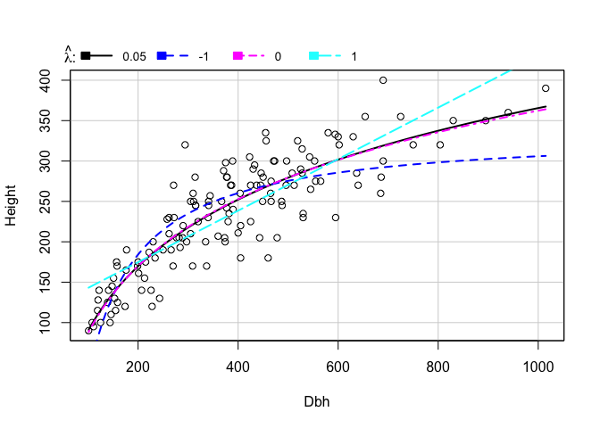<!-- -->

    ##        lambda      RSS
    ## 1  0.04787804 152122.8
    ## 2 -1.00000000 197352.2
    ## 3  0.00000000 152232.3
    ## 4  1.00000000 193739.7

So in this case the suggest transformation is $\lambda=.05$. Do you
really want to tell a client that you have in your model $X^.05$ in a
scaled form? In this case if we look at reasonable transformations
$\lambda \in \{-1,0,1\}$ we see that $\hat{\lambda}=0$ produces a
reasonable result. This means we want to use the model $$
E(Height \mid Dbh)=\beta_0+\beta_1\log(Dbh)
$$

### Transforming the Response

In some settings, especially in MLR, it is difficult to decide what
predictors to transform, or explain what the transformed variable means.
The question is how do we do this? One graphical method is known as
inverse fitted value plot. Let $\hat{y}$ be the fitted values from the
regression of the untransformed response. We find the $\lambda$ that
minimizes the following residual sum of squares of the regression $$
E(\hat{y} \mid Y)=\alpha_0 +\alpha_1 \psi_S(Y, \lambda)
$$ Though this is not a bad thought the most common way to do this is
what is known as the box cox method. There is a general form for doing
this, which is referred to as a modified power family for some strictly
positive variable

$$
\psi_M(Y,\lambda)=gm(Y)^{1-\lambda}\frac{(Y^\lambda-1)}{\lambda}\,\,\, \lambda\neq 0\\
= gm(Y)*\log(Y)
$$

Where $gm(Y)=e^{\sum\log(y)/n}$, is the geometric mean. So what we do is
fit the regression $$
E(\psi_M(Y,\lambda)\mid X)=X\beta
$$

Then we choose the transformation that minimizes $RSS(\lambda)$. Up to
this point we’ve been transforming for linearity, but Box-Cox transforms
for normality. That is $\lambda$ is chosen to make the residuals normal,
or approximately normal. In this case graphical methods are used for
selection.

``` r
M1=lm(BrainWt~log(BodyWt),data=brains)
M1%>%boxcox()
```

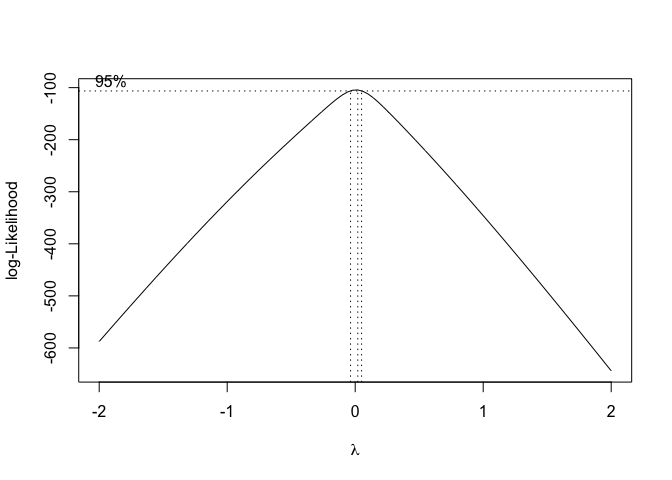<!-- -->

Notice 3 lines show up that maximize the likelihood (same as minimizing
the RSS). This grid is the $95\%$ CI for the parameter $\lambda$. We
choose a nice value inside this grid. This also works for multiple
regression problems.

``` r
M2=lm(BigMac~log(Rice)+log(Bread), data=BigMac2003)
M2%>%summary()
```

    ## 
    ## Call:
    ## lm(formula = BigMac ~ log(Rice) + log(Bread), data = BigMac2003)
    ## 
    ## Residuals:
    ##     Min      1Q  Median      3Q     Max 
    ## -43.079 -13.436  -3.110   8.854  95.849 
    ## 
    ## Coefficients:
    ##             Estimate Std. Error t value Pr(>|t|)    
    ## (Intercept)  -82.523     14.749  -5.595 4.58e-07 ***
    ## log(Rice)     28.603      5.914   4.837 8.25e-06 ***
    ## log(Bread)    13.175      5.246   2.512   0.0145 *  
    ## ---
    ## Signif. codes:  0 '***' 0.001 '**' 0.01 '*' 0.05 '.' 0.1 ' ' 1
    ## 
    ## Residual standard error: 22.31 on 66 degrees of freedom
    ## Multiple R-squared:  0.5108, Adjusted R-squared:  0.496 
    ## F-statistic: 34.46 on 2 and 66 DF,  p-value: 5.657e-11

``` r
M2%>%boxcox()
```

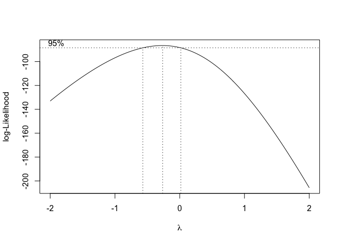<!-- -->

Again notice the $95\%$ interval contains log. So this case suggests a
log transformation.

Let’s see what the inverse fitted value plot has to say about this
transformation.

``` r
M2%>%invResPlot()
```

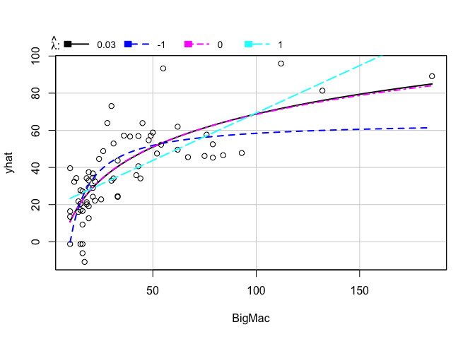<!-- -->

    ##        lambda      RSS
    ## 1  0.03118226 13897.90
    ## 2 -1.00000000 16546.34
    ## 3  0.00000000 13900.87
    ## 4  1.00000000 16775.59

We can see this agrees with the box cox method. So transforming for
normality of this residuals, is the same as transforming for residuals.
There is no theoretical reason these two will work together but it is
nice to know that they do.

### Automatic Selection of Transformation of Predictors

In a MLR setting we want transformations of predictors so that each of
the predictors have a linear mean function against all the others.
Notice this does not denote high linearity it just keeps us from having
curvature between predictors. The idea is we start with $k$
un-transformed predictors $X$. we apply a modified power transformation
to each $X_j$. So now we have $\lambda=(\lambda_1, \ldots, \lambda_k)$.
Let $V(\lambda)$ be the covariance matrix of the transformed predictors,
then we want to select a $\hat\lambda$ that minimizes the log
determinant of $V$. This is all well and good and can easily be done
using software.

To do this in R we will look at an example from the Highway data in alr4
package

``` r
#summary(powerTransform(cbind(len, adt, shld ,trks, sigs1) ~ 1, Highway1))
Highway1%>%powerTransform(cbind(len, adt, shld ,trks, sigs1) ~ 1,.)%>%summary
```

    ## bcPower Transformations to Multinormality 
    ##       Est Power Rounded Pwr Wald Lwr Bnd Wald Upr Bnd
    ## len      0.1437           0      -0.2732       0.5607
    ## adt      0.0509           0      -0.1854       0.2872
    ## shld     1.3456           1       0.6341       2.0570
    ## trks    -0.7028           0      -1.9134       0.5078
    ## sigs1   -0.2408           0      -0.5341       0.0525
    ## 
    ## Likelihood ratio test that transformation parameters are equal to 0
    ##  (all log transformations)
    ##                                    LRT df      pval
    ## LR test, lambda = (0 0 0 0 0) 23.32447  5 0.0002926
    ## 
    ## Likelihood ratio test that no transformations are needed
    ##                                    LRT df       pval
    ## LR test, lambda = (1 1 1 1 1) 132.8574  5 < 2.22e-16

Notice we have the estimates of $\lambda_j$ for each predictors, and
standard errors. These standard errors are useful for creating CI’s for
each of the variables. At the bottom we then have a likelihood ratio
statistic, and equivalently a p-value. In R we always see 3
transfromations, all 1’s (no transform), all 0’s (log transform), or the
closest nice value to the estimated. All of these tests compare the
listed to the estimated. We want a nice transformation that is the same
as the predicted, and since this is multivariate we can’t just select
the best from all the CI’s we have jointly select them. In this case it
suggests only leaving shld, and replacing all other variables with the
log transform.

### Non-Positive Variables

When variables have possible zero’s or have negative values one possible
way is to transform variables to be the form $(X+\gamma)^\lambda$. Where
we set $\gamma$ to be large enough that the value is always positive.
Note just setting for the minimum of a data set will not work. Another
method that can be used is known as Yeo and Johnson Transformation. We
define these by $$
\psi_{YJ}(X,\lambda)=\psi_M(X+1,\lambda) \,\,\,\, U\geq0 \\
= -\psi_M(-X+1, 2-\lambda) \,\,\,\, U<0
$$

If $X\geq 0$ this is just the box cox transform of $X+1$. If $X<0$ it is
just the box cox transform of $(-U+1)$ with power $2-\lambda$. This is a
nice approach but it practice shifting by a certain value makes more
sense than explaining the Yeo-Johnson Transformation. The Yeo-Johnson
Transformation can be found in R, by looking through the help files of
powerTransform and boxcox.

### A Few “Important” Thoughts

Transformations are something that can save you a lot of time in
diagnostics and issues if you will do your work early. What do I mean by
do your work early? Typically when you are familiarizing yourself with a
data set you should be looking at summaries and plots that can give you
an indication of what may be useful to transform. Also you should use
transformations to think about validity of your model. For example if
your response is stritly positive, and you fit OLS is it reasonable that
your model could produce negative values? These are the type of things
you can use things such as $log$ and square root transformations to get
around. This is some of the stuff that has to differentiate what we do
from what others do, we are about fitting models that make sense for the
data at hand and trying to leverage what we can find from a relationship
stand point in the data we are working on. This isn’t about theory or
anything of that nature but more about how can we find an informative
model that will help us better understand whats happening.

## Outliers, Leverage and Influence

The assumptions

$$
E(\epsilon \mid U)=0\\
Var(\epsilon)= \sigma^2
$$

can be checked using the diagnostic methods we have discussed
previously. These diagnostics can sometimes be masked by a few of the
data points do not correspond to the same model that resembles most of
the data. This can occur in the space of $Y$ when a fitted value
$\hat{Y}$ is clearly different than the actual value, what we call an
outlier. This also occurs when we have a value that is completely
different in the $X$ space, either one of these will indicate data that
will not work well for our model. The questions become how do we
recognize these data points? How do we fix them?

### Recognizing Outliers

The first thing we need to do is put a true definition on an outlier. In
regression we define an outlier as a point that does not follow the same
model as the rest of the data. Specifically we will look to detect mean
shift outliers. That is the true mean function for all but the $i$th
case is $$
E(Y \vert X=x_j)=x_j^T\beta
$$ while the $i$th case follows the $$
E(Y \vert X=x_i)=x_i^T\beta + \delta
$$

So the idea is the possible outlier is shifted by magnitude $\delta$
than where we would expect it to be. The first test we can use is a test
of $\delta=0$. In this test we will assume $\Var(Y \vert X)=\sigma^2$.
To preform this test we need to define a new variable $U$. $U$ is a
vector of all 0’s except for the $i$th element. So for the test for the
$i$th case U looks like  
$$
U=\left(\begin{array}{c}
u_1 \\ 
\vdots \\ 
u_{i-1} \\ 
u_i \\ 
u_{i+1}\\ 
\vdots
\end{array}  \right)=\left(\begin{array}{c}
0 \\ 
\vdots \\ 
0 \\ 
1 \\ 
0\\ 
\vdots
\end{array}  \right)
$$

$U$ is what we call an indicator variable of the $i$th case, it is a 1
for the $i$th observation and 0 every place else. You will see this much
more in the next module.

For the test fit the regression $$
E(Y \vert X,U)=X\beta+\delta U.
$$ The test for the $i$th case to be an outlier is the test that
$\delta=0$. So we test $$
H_0: \delta=0\\
H_A: \delta \neq 0
$$

For this test to work we have to assume $\epsilon$ is normally
distributed, and then we use a t-distribution with $n-p-2$ degrees of
freedom. We use $p-2$ since we have added a second variable $U$.

A second approach will lead to the same test but will set up an approach
that we are going to use through out this chapter. It will lead to the
same test but uses a different motivation. Let the notation
$\sigma^2_{(i)},\, \beta_{(i)}, \hat{Y}_{(i)}$, be the estimate of the
parameters without the $i$th data point.

Again suppose we are trying to see if the $i$th data point is the
outlier. Our “remove case test” works as follows:

1.  Delete the $i$th case from the data , so we have data $X_{(i)}$ and
    $Y_{(i)}$.
2.  Obtain estimates for $\beta_{(i)}$, $\sigma^2_{(i)}$.
3.  Computer $\hat{y}_{i(i)}=x^T_i\beta_{(i)}$. We also have that
    $\hat{y}_{i(i)}$ are independent of one another.
4.  To test $\delta=0$ we need to define $t_i$ under the null hypothesis
    as $$
    t_i=\frac{y_i-\hat{y}_{i(i)}}{\hat{\sigma}_{(i)}\sqrt{1+x_i^T(X_{(i)}^TX_{(i)})^{-1}x_i}} \sim t_{n-p-2}
    $$

The leave one out residuals are also known as the jackknife residuals.
Notice that $t_i$ treats the $i$th observation just like we would a
value now shown in our data. That means the standard error estimate is
the same as we could get for a prediction interval if we used the data
$X_{(i)}, Y_{(i)}$. What this test is really doing is saying the data we
do not consider an outlier creates a data generating model, could the
$i$th observation be generated from this model? Seems like a reasonable
question. Computationally $t_i$ can be a little challenging, but there
is a shorter computational form.

Define the standardized residual as $$
r_i=\frac{\hat{\epsilon}_i}{\hat{\sigma}\sqrt{1-h_{ii}}},
$$ where $h_{ii}$ is the leverage of the $i$th case. Just like the
residuals $r_i$ has mean zero, but it has variance 1 (why we call it
standardized). We can then say that the studentized residual or
studentized statistic is $$
t_i=r_i(\frac{n-p-2}{n-p-r_i^2})^{1/2}
$$

To extend this to the setting where $Var(Y \vert X)=\sigma^2/w_i$, just
use the correction for $\hat{\epsilon}_i$.

#### Correction For Multiple Tests

Given we know what case could be an outlier we can directly test it by
just comparing it to the specific distribution we defined with the test.
This doesn’t happen often, normally what happens is we test the value
with the largest $\vert t_i \vert$. This is the same thing as testing is
any point an outlier, so we have preformed $n$ tests. Thinking about
what we know about p-values, if we have 100 tests where the null is
true, using a .05 rejection criterion we will reject the null 5 times.
So if we run $n$ tests, at an $\alpha$ rejection criterion we expect to
reject $n\alpha$ tests, even if the null is true for all of them. There
are many ways to correct for this the most common and the one we will
use is known as the Bonferroni Correction which uses a rejection
criterion of $\alpha/n$. This is a conservative test but very popular in
practice.

### Example

``` r
library(alr4)
library(car)
library(MASS)
data(rat)
attach(rat)
Model2=lm(y~BodyWt+LiverWt+Dose,data=rat)
help(outlierTest)
Model2%>%outlierTest()
```

    ## No Studentized residuals with Bonferroni p < 0.05
    ## Largest |rstudent|:
    ##    rstudent unadjusted p-value Bonferroni p
    ## 19 2.138833           0.050557      0.96058

``` r
Jack=Model2%>%rstudent()
plot(Model2$res,ylab="Residuals")
```

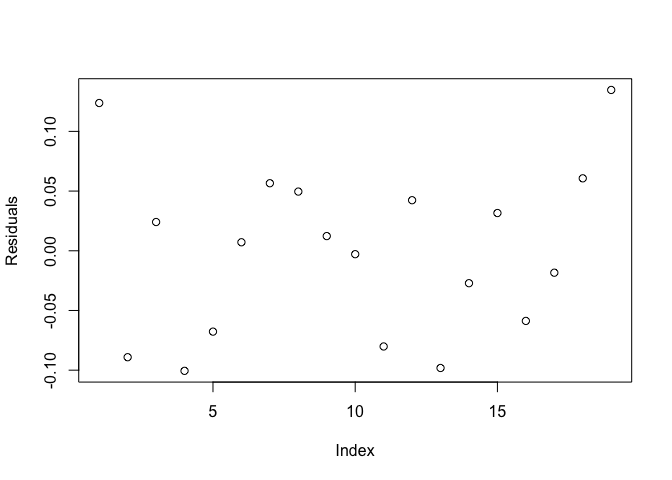<!-- -->

So we can see from the plot we expect case 19 to have the largest
studentized residual , rstudent() explicitly calculates this. The
function rstandard() will calculate the standardized residuals.
outlierTest() will show the t-test for the studentized residuals.
Looking at a second example of the Forbes data where we thought there
was a possible outlier we have that

``` r
library(alr4)
attach(forbes)
mod=lm(lpres~bp,data=Forbes)
mod%>%outlierTest()
```

    ##    rstudent unadjusted p-value Bonferroni p
    ## 12 12.40691         6.0892e-09   1.0352e-07

This is a case where the Bonferroni correction may not be needed since
from the plot we could see that the 12th observation could be a problem.
To see all of the options of viewing the Bonferoni correction see
help(outlierTest) Since we see we have an outlier in the data let’s
check the residual plot, and our other diagnostics

``` r
mod%>%ncvTest()
```

    ## Non-constant Variance Score Test 
    ## Variance formula: ~ fitted.values 
    ## Chisquare = 0.7529636, Df = 1, p = 0.38554

``` r
mod%>%residualPlots() 
```

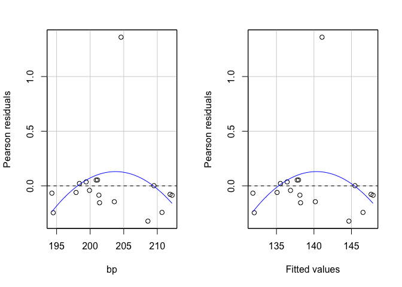<!-- -->

    ##            Test stat Pr(>|Test stat|)
    ## bp           -1.3219           0.2074
    ## Tukey test   -1.3219           0.1862

So we can see that the model has an obvious problem but our diagnostics
of ncv and curvature do not detect it. The next question would be how do
we fix this?

### Influence

Possibly in other statistics courses, people would begin to discuss how
to remove or deal with outliers, but again we do things just a little
bit different. Are outliers really a problem? Outliers only are
problematic in regression if they change the resulting predicted values
of a model, or inference of a model significantly. If an outlier does
not effect the results of our analysis, then there is really no need to
correct it. The main idea of influence analysis is to study what slight
perturbations of the data will do to the model we use. One of the most
important things we can see in the data is if we remove an observation
how much effect should it have. If our model is robust removing a data
point should have very little effect on the model. This is one way we
can tell if our model is sample dependent. We define cases that result
in significant changes in the model as influential.

The question is how do we measure how much an analysis can change by
removing a data point. Since the 3 estimates we normally care about
$\hat{\beta}, \hat{Y}$, and $\hat{sigma}^2$ all have the relationship $$
\hat{\beta}=(X^TX)^{-1}X^TY\\
\hat{Y}=X\hat{\beta}\\
\hat{\sigma}^2=((Y-\hat{Y})^T(Y-\hat{Y}))/(n-p-1)
$$

So all estimates depend on the estimate of $\hat{\beta}$, so that is
where we will start. We need to find $\hat{\beta}_{(i)}$ (using the same
notation as the previous section). To do this we get $$
\hat{\beta}_{(i)}=(X_{(i)}^TX_{(i)})^{-1}X_{(i)}^TY_{(i)}
$$

### Cook’s Distance

We said we wanted to look at $\hat{\beta}_{(i)}$ as our measure of
influence of point $i$, but it is a $p$-dimensional vector, so how is
that possible? Cook (1977) (Professor Dennis Cook, from University of
Minnesota) suggested that we can reduce this $p$ dimensional vector to a
single number. We define Cook’s Distance, $D_i$ to be $$
D_i=\frac{(\hat{\beta}_{(i)}-\hat{\beta})^T(X^TX)(\hat{\beta}_{(i)}-\hat{\beta})}{(p+1)\hat{\sigma}^2}
$$

$D_i$ has some great properties, the two we care about the most are
Another way to write Cook’s Distance is by distributing $(X^TX)$ that
appears in $D_i$ which results in $$
D_i=\frac{(\hat{Y}_{(i)}-\hat{Y})^T(\hat{Y}_{(i)}-\hat{Y})}{(p+1)\hat{\sigma}^2}.
$$

Then $D_i$ is just the distance between $\hat{Y}$ and $\hat{Y}_{(i)}$.

So cases for which $D_{(i)}$ is large have influence on our analysis,
and removing these points could drastically change the conclusions of
our analysis, meaning our model isn’t robust.

### Magnitude of Cook’s Distance (What really matters!)

In practice we don’t care about every $D_i$, but only the (few) largest
case(s). In this case we have a rule of thumb. The rule of thumb for
Cook’s Distance is:

- If $D_i< .5$ it is not influential
- If $.5 \leq D_i < 1$ it may or may not be influential (we might need
  to check it)
- If $D_i \geq 1$ the point is influential, and we should see what it
  changes in the analysis

This rule of thumb is based off the fact $D_i$ follows an $F$
distribution, and most critical values of at the $50 \%$ point are
around 1. In essence if you are worried about influence in your analysis
remove the point with the largest $D_i$ and see what it effects.

### Computationally Friendly $D_i$

As in outlier testing removing a point an rerunning an analysis can be
computationally difficult. However we can rewrite $D_i$ in the form $$
D_i=\frac{1}{p+1}r_i^2\frac{h_{ii}}{1-h_{ii}}
$$

Notice its combination of the standardized residual $r_i$ and the
leverage, $h_{ii}$. So a point could possibly be influential if it is
extreme in the $X$ space, extreme in the $Y$ space or a combination of
both. This is what we need to remember and these calculations help us
understand where our issues lie. If we have influence because we have an
outlier, then we could possibly transform the data out. If leverage is
the problem we could begin to look at how transformations would deal
with this. You only remove data, when you have a reason to believe it
does not fit the in the population of interest.

An example of this is an experiment in a lab where a researcher ran out
of lids for petry dishes, and ran the experiement with some lids off and
some lids on. The dishes with the lids off have results nothing like
what the ones that had lids, so we can look at removing the data points
that had lids off, because they come from a completely different system.
The point is we can’t remove data because it doesn’t fit our naritive.

### Example

So let’s see how we do this referring to the forbes data we have

``` r
mod%>%infIndexPlot()
```

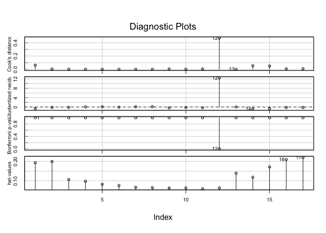<!-- --> Note that
the hat-values in this case are the Leverages. So we can see from the
plot that observation 12 shows as an outlier, but the Cook’s distance is
around .5. Just to be safe let’s investigate what happens when the 12th
observation is removed

``` r
mod2=lm(lpres~bp, data=Forbes[-12,])
mod2
```

    ## 
    ## Call:
    ## lm(formula = lpres ~ bp, data = Forbes[-12, ])
    ## 
    ## Coefficients:
    ## (Intercept)           bp  
    ##     -41.308        0.891

``` r
mod
```

    ## 
    ## Call:
    ## lm(formula = lpres ~ bp, data = Forbes)
    ## 
    ## Coefficients:
    ## (Intercept)           bp  
    ##    -42.1378       0.8955

So in essence there is very little change in the coefficients. In the
context of the problem what does this change, a -1 decrease in the log
pressure, and a small increase in the slope. Another way to view the
similarity is to plot the fitted values of both the models against each
other.

``` r
Fit=predict(mod2,data.frame(forbes[12,]))
Fit
```

    ##       12 
    ## 140.9874

``` r
Mod2Fit=c(mod2$fitted[1:11],Fit,mod2$fitted[12:16])
plot(Mod2Fit~mod$fitted)
```

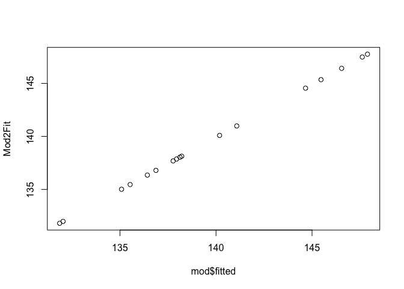<!-- -->

So just visually it doesn’t seem like there is a substantial change in
the model. In chapter 11 we will discuss a few different ways to do
model validation in this case.

Looking at our lab rat example we have the diagnostics

``` r
Model2%>%infIndexPlot()
```

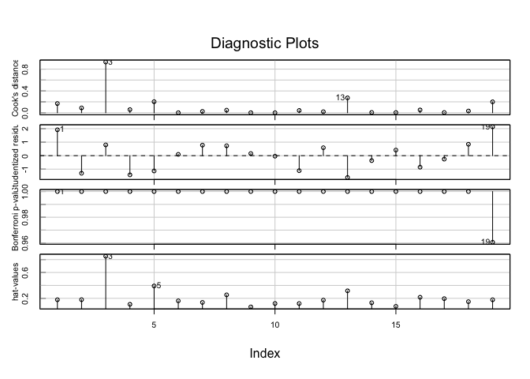<!-- -->

Notice in this case we have a large Cook’s Distance of observation 3.
but the residual is small. What this indicates is that it has an extreme
value in the $X$ space. So the question becomes what does it change in
the analysis,

``` r
Mod22=Model2%>%update(rat[-3,])
Mod22
```

    ## 
    ## Call:
    ## lm(formula = BodyWt ~ LiverWt + Dose + y, data = rat)
    ## 
    ## Coefficients:
    ## (Intercept)      LiverWt         Dose            y  
    ##      8.7666       0.3937     191.1064     -15.1193

``` r
Model2
```

    ## 
    ## Call:
    ## lm(formula = y ~ BodyWt + LiverWt + Dose, data = rat)
    ## 
    ## Coefficients:
    ## (Intercept)       BodyWt      LiverWt         Dose  
    ##     0.26592     -0.02125      0.01430      4.17811

Notice that all the coefficients change substantially in this case.
Let’s look at how observation 3 relates to the rest of the data

``` r
rat[3,]
```

    ##   BodyWt LiverWt Dose    y
    ## 3    190       9    1 0.56

``` r
summary(rat)
```

    ##      BodyWt         LiverWt            Dose              y         
    ##  Min.   :146.0   Min.   : 5.200   Min.   :0.7300   Min.   :0.2100  
    ##  1st Qu.:160.5   1st Qu.: 7.050   1st Qu.:0.8050   1st Qu.:0.2750  
    ##  Median :176.0   Median : 7.900   Median :0.8800   Median :0.3300  
    ##  Mean   :171.5   Mean   : 7.811   Mean   :0.8621   Mean   :0.3353  
    ##  3rd Qu.:183.5   3rd Qu.: 8.900   3rd Qu.:0.9200   3rd Qu.:0.3750  
    ##  Max.   :200.0   Max.   :10.000   Max.   :1.0000   Max.   :0.5600

We can see that the 3rd observation is on the high end of both body
weight and liver weight, which means its much different from the mean in
two variable, so it is very different from the rest of the data. There
are a few ways to deal with this the first, is to remove the point and
say it is not representative of the sample (this isn’t a good idea
unless you are absolutely certain this is true). The second thing you
can do to decrease the leverage of a point is to transform the $x$ space
of your model. Taking a log transformation or square root transformation
would increase the similarity of that point to the rest of your data in
regards to that variable. That could help stabilize your analysis.

### Normality Assumption

Until recently it had been thought that the major assumptions for OLS
regression were $$
E(Y \vert X)=X\beta, \,\,\,\,\, \epsilon\sim N_n(0, \sigma^2I_n)
$$

The truth is this assumption is useful primarily when your sample size
is small, and even then we can get by with bootstrap. A problem with
this is it is difficult to see normality of residuals when the sample
size is small. We use the fact that $$
\hat{\epsilon}=(I-H)Y\\
=(I-H)(X\hat{\beta}+\epsilon)\\
=(I-H)\epsilon
$$

In a different form the equation for the $i$th residual becomes $$
\hat{\epsilon}_i=\epsilon_i-\sum_{j=1}^nh_{ij}\epsilon_j.
$$

In this form we have the $i$th theoretical residual and a linear
combination of all the theoretical residuals. By the central limit
theorem this will generally follow a normal distribution even if the
residuals are not normal. For moderate or small sample sizes the second
term can dominate the first ($h_{ij}$) tends to be large, and then the
residuals behave like a normal sample. This is what is referred to as
supernormality.

For a fixed number of variables, as $n$ increases the distribution of
$\hat{\epsilon}$ will more resemble that of $\hat{\epsilon}$, so we can
use this for a test. In stead of a “true” test we will use what is known
as a normal probability plot.

A normal probability plot is a very simple plot that can give us alot of
information. The basis of the plot is pretty simple. First obtain a
sample from a population we wish to see is normal with unknown mean and
variance $z_1,\ldots, z_n$. The plot is produced by

1.  Order the $z$’s from $\min(z_i)=z_{(1)},\ldots, z_{(n)}=\max(z_i)$

2.  Let $u_{(1)},\ldots, u_{(n)}$ be the expected values of the order
    statistics if we took many samples from a normal distribution. We
    call these the expected order statistics. This can be calculated
    fairly easily see footnote in your text.

3.  If the $z$’s are normal then the regression of $z$ on $u$ will be a
    straight line.

There have been many other statistics developed such as the Shapiro and
Wilk W statistic, which squares the correlation between $z$ and $w$ and
rejects if the correlation is too small. This is similar to just
observing if the normal probability plot is a straight line. Looking at
the rat data from above we can produce the qqnorm plot

``` r
qqnorm(residuals(Mod22), main="Rat QQ-Plot")
```

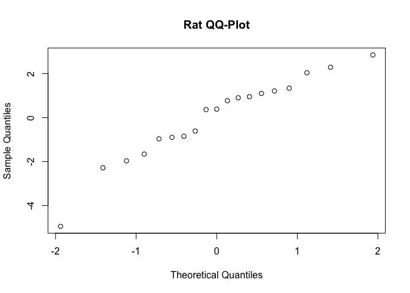<!-- -->

The sample size is small but there seem to be small deviations from
normality, possibly in the tails, but nothing that seems to worry too
much since the sample is small. So we should should investigate it
further using bootstrap or a boxcox transform for normality.

``` r
boxcox(Mod22)
```

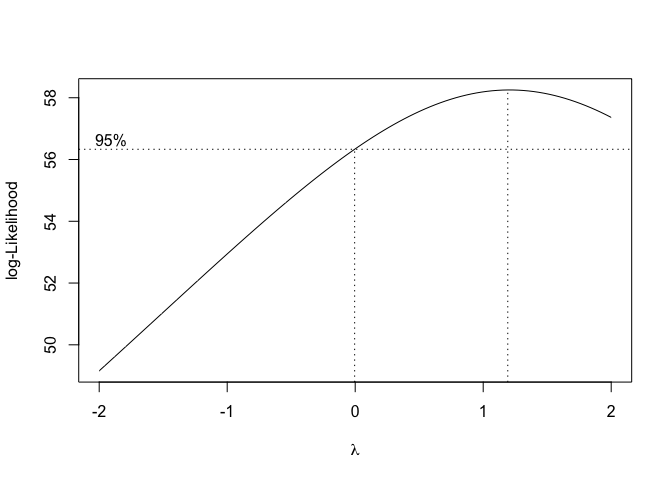<!-- --> Clearly 1
is in the CI, so it tells us a transformation for normality is
unnecessary. Note this is based on a small sample so it is unclear how
helpful it is.

If we have more data such as the heights data we can see the normality
clearly.

``` r
h1<-lm(dheight~mheight, Heights)
h1%>%residuals()%>%qqnorm(main="Height QQ-Plot")
```

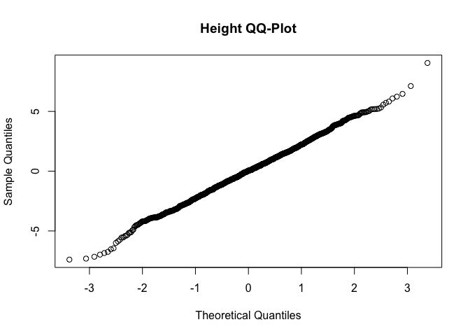<!-- -->

There is no question about the normality in the residuals in this case.
The slight deviation from the line in the lower tail is no cause for
concern. In reality not many plots will have slight derivations, it is
up to you to decide whether they are important or not.

Another way to visualize these plots is to use the default plot in R of
any model. To do this all we do is create a 2 by 2 grid that will give
us ideas about the residual plot, normality, and influence.

``` r
par(mfrow=c(2,2))
plot(h1)
```

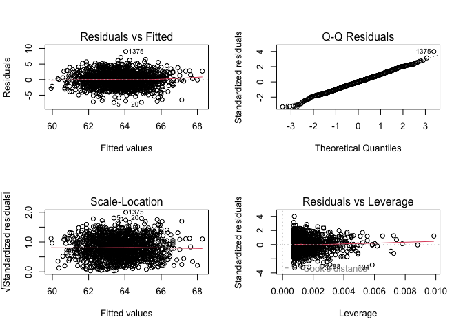<!-- -->

The plot in the top left quadrant is the residual plot of the residuals
vs the fitted values, the top right is the normal qq plot and the bottom
left is a plot of the residual vs the leverage, which in turn tells us
about the influence of the point. In the corners of this plot we will be
able to see if any points have influence as they will be contoured with
red lines around them labeling either 0.5 or 1. In the plot above we
don’t see any possible leverage points.

Let’s take a look at the residual plots show from the UN data.

``` r
mUN=lm(ppgdp~lifeExpF+pctUrban, data=UN11)
par(mfrow=c(2,2))
plot(mUN)
```

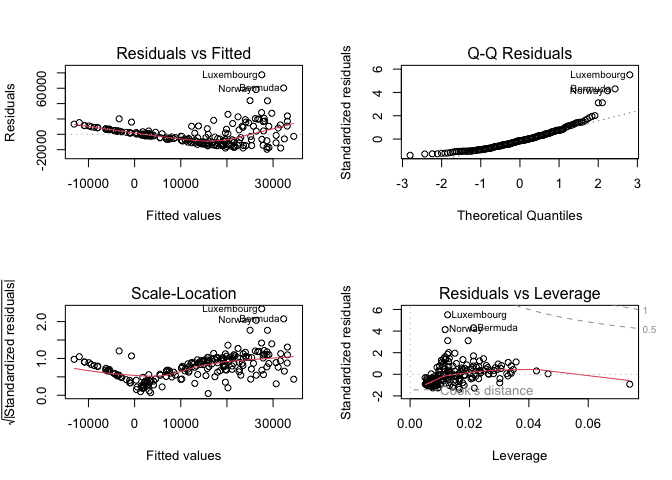<!-- -->

First we can see the the residual vs fitted plot looks awful, there is
curvature and possibly non-constant variance. The normality does not
look great either, we always ignore the bottom left plot. Then the
bottom right plot we see the red dotted contours appear in the top
right. If a data point would fall in those contours then it could have
influence, if it would be above the top contour then it does have
influence and we need to look into how to fix that data point.

In essence we only care when points have influence, it means they change
our analysis and then we need to adjust. Removing the data point is the
last option and only if you have good reason to remove the point (it
doesn’t come from the same population, wasn’t recorded under the same
conditions, doesn’t make sense in your sample), but other than that we
should use transformations to stabilize the data.

## Summary

In this module we’ve covered all of diagnostics. I’ve left some more of
the math heavy pieces in for you but the take away are simple. The goal
is to meet the assumptions of the regression model, so we can do
inference. The diagnostic tools we have are

- Linearity: Check the residual vs fitted plot/ Tukey Test
- Non-Constant Variance: NCV Test/ Check the residual vs fitted plot
- Normality: Check the normal qq plot/ Other tests available
- Influence: Cook’s Distance

After diagnostics are done we need to fix the issues we have. How do we
do that?

- Linearity: Transformations and/or higher order terms (which we discuss
  in the next module)
- Non-Constant Variance: Weighted Least Squares/ Transformations
- Normality: Transformations
- Influence: Investigate the source of the issue (outlier, leverage,
  mix), and transform the issue out, or figure out if the point is
  representative of the sample.

All of these fixes are useful for the linear regression setting, but
there are other techniques that you will see throughout your course work
that can fix these issues such as using generalized linear models,
non-linear regression models, and even additive models. We focus on
linear regression right now, because it’s the most common type of model
people use and can build on all other topics that you need.
